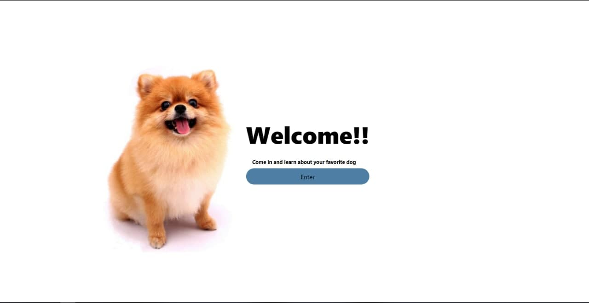
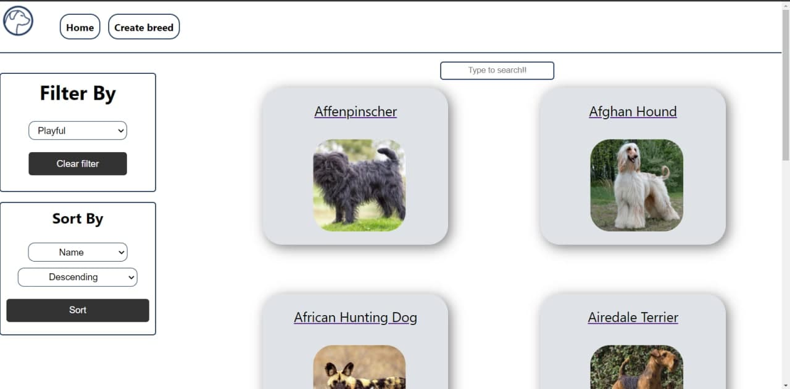
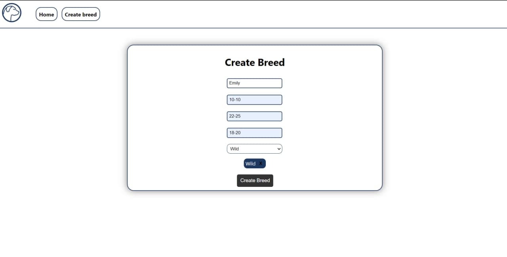
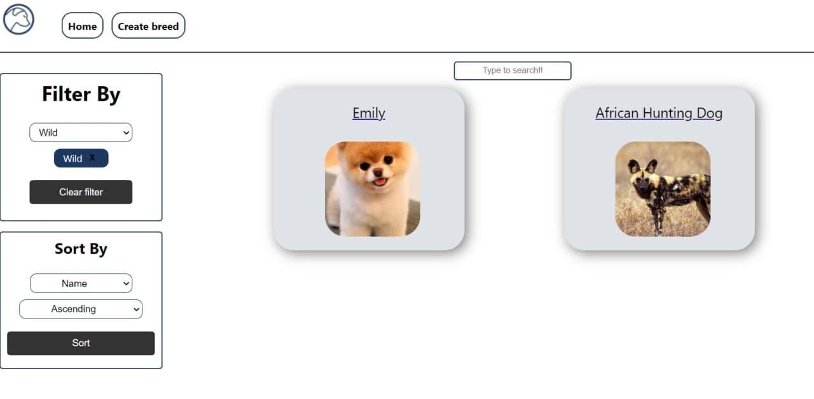

<p align="center">
  
</p>
    
# Dog App

Application for dog lovers🐶❤, where they can see & create a breed and see additional
 information such as a range of weight and height with their respective temperaments
  without forgetting a respective image showing how the breed of the dog is.👻


## Environment Variables

To run this project, you will need to add the following environment variables to your .env file

`DB_USER` 

`DB_PASSWORD`

`DB_HOST` You can leave it as Local host

`key`
## Installation 

First of all we clone the repository

```bash 
git clone https://github.com/emily883/PI-Dogs-FT__13__.git
```

We install dependencies in both folders the api and client

Go to the folders with these commands

```bash
cd client
```

```bash
npm install
```

Then to the other folder

```bash
cd api
```

```bash
npm install
```

Then wait for the dependencies to be installed, when finished run in both cases...

```bash
npm start
```

When our program starts up, it will automatically open in your browser.

😎Enjoy it!!!😎<br>
<br>
<h2 align="center">ScreenShots</h2>
<hr>
<br>
<h3 align="center">Welcome Page</h3>
<br>

<br>
<p align="center">

</p>
<br>

<br>
<h3 align="center">Homa Page Show the Breeds</h3>

<br>
<p align="center">

</p>

<br>
<br>
<h3 align="center">You can create a breed only by filling in the required information</h3>

<br>
<p align="center">

</p>

<br>
<br>
<h3 align="center">You can filter the dogs by temperaments, search among the filtered ones and organize them by name in alphabetical order and by weight.</h3>

<br>
<p align="center">

</p>


